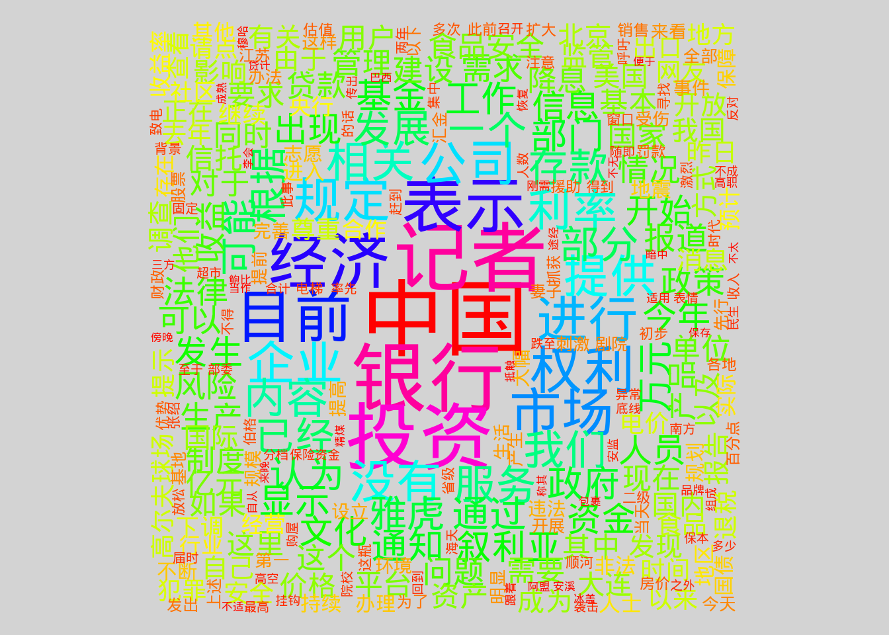
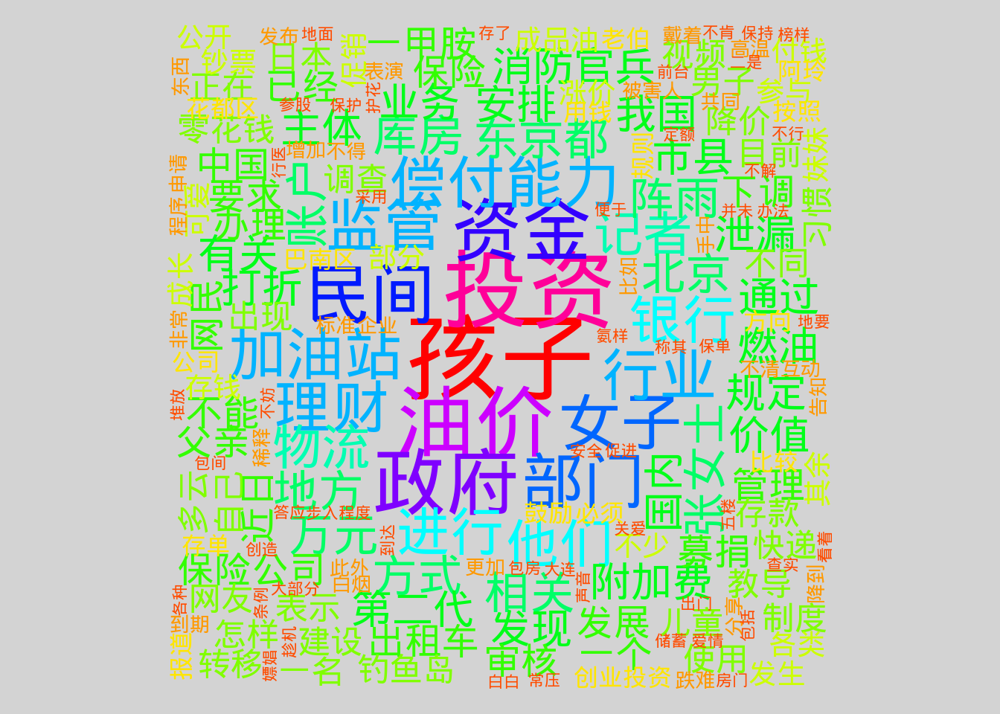

## 1.读取数据（推荐readr包的各种函数）

```{r,eval=F}
library(readr)
library(jiebaR)
library(tmcn)
#读取数据文件
#数据来源http://download.labs.sogou.com/dl/sogoulabdown/SogouCA/news_tensite_xml.smarty.zip
d1<-read_lines('news_tensite_xml.smarty.dat')
#转换编码方式
# library(devtools)
# devtools::install_github("qinwf/checkenc")
library(checkenc)
old_enc<-checkenc("news_tensite_xml.smarty.dat")
d1<-iconv(d1,from=old_enc,to='utf-8')
```

## 2.剔除无关项，仅保留title和content中的文本，另存为csv文件

```{r,eval=F}
  tmp<-d1
  grep('<contenttitle>',tmp)->t1
  grep('<content>',tmp)->t2
  
  gsub("<contenttitle>",'',tmp[t1])->tmp_t
  gsub("</contenttitle>",'',tmp_t)->tmp_t
  # tmp_t
  
  gsub(pattern = '\n',x = tmp_t,replacement = "")->tmp_t
  
  gsub("<content>",'',tmp[t2])->tmp_c
  gsub("</content>",'',tmp_c)->tmp_c
  gsub(pattern = '\n',x = tmp_c,replacement = "")->tmp_c
  wenben<-data.frame(title=tmp_t,content=tmp_c,stringsAsFactors = FALSE)
  write_csv(wenben,path='test_data.csv')
  write(wenben$content,file='test_con.txt')
```

## 3.中文分词

```{r,eval=F}

#jiebaR
#stopwords.txt文件可以从网络检索下载
cutter = worker(stop_word = 'stopwords.txt',bylines = TRUE,output = 'jieba_seg.txt')
cutter <='test_con.txt'
```

## 4.构建语料库及文档词条矩阵

```{r,eval=F}
 #构建语料库
library(tm)
library(tmcn)
#读入分词文件
sample.words<-read_lines('jieba_seg.txt')
# sample.words[sample.words!=""]->sample.words
#创建语料库
corpus = Corpus(VectorSource(sample.words))
#建立文档-词条矩阵
sample.dtm <- DocumentTermMatrix(corpus, control = list(wordLengths = c(2, Inf)))
sample.tdm <-  TermDocumentMatrix(corpus, control = list(wordLengths = c(2, Inf)));

```
## 5.词云图

```{r,eval=FALSE,warning=FALSE}
library(wordcloud)
op<-par()
m<-as.matrix(sample.tdm)
wordfred<-sort(rowSums(m),decreasing=T)
set.seed(375)
op = par(bg = "lightgrey")      #背景为亮黄色
wordcloud(words=names(wordfred),freq=wordfred, min.freq=2,random.order=F,col = rainbow(length(wordfred)))
par(op)      
```


## 6.主题模型

```{r,,eval=F}
#主题模型
library(slam)
summary(col_sums(sample.dtm))
term_tfidf  <- tapply(sample.dtm$v/row_sums( sample.dtm)[ sample.dtm$i],   sample.dtm$j,  mean)* 
   log2(nDocs( sample.dtm)/col_sums( sample.dtm  >  0))
summary(term_tfidf)
 
sample.dtm  <-  sample.dtm[,  term_tfidf  >=  0.1]
sample.dtm  <-  sample.dtm[row_sums(sample.dtm)  >  0,]
 
#lda主题模型，分10类主题
 library(topicmodels)
 k <- 10
 
 SEED <- 2010
 #4中不同参数的实现
 VEM = LDA(sample.dtm, k = k, control = list(seed = SEED))
  VEM_fixed = LDA(sample.dtm, k = k,control = list(estimate.alpha = FALSE, seed = SEED))
  Gibbs = LDA(sample.dtm, k = k, method = "Gibbs",control = list(seed = SEED, burnin = 1000,thin = 100, iter = 1000))
  CTM = CTM(sample.dtm, k = k,control = list(seed = SEED,var = list(tol = 10^-4), em = list(tol = 10^-3)))
#VEM模型的主题拟合及预测
  lda_inf<-posterior(VEM,sample.dtm)

```

## 7.主题看词云

```{r,warning=FALSE,eval=F}
tops<-apply(lda_inf$topics,1,which.max)
k<-3
op<-par()
mo<-as.matrix(sample.tdm)
m<-mo[,as.numeric(names(tops[tops==k]))]
 wordfred<-sort(rowSums(m),decreasing=T)
 set.seed(375)
 op = par(bg = "lightgrey")      #背景为亮黄色
 wordcloud(words=names(wordfred),freq=wordfred, min.freq=2,random.order=F,col = rainbow(length(wordfred)))
 par(op)      
 
```


